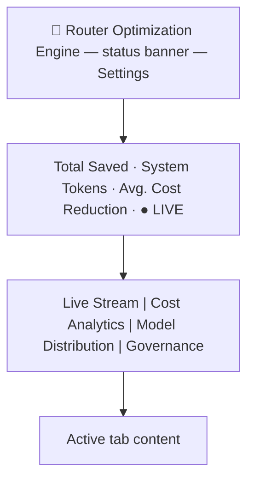

# AgenticRouter.Gui Dashboard

This document describes the dashboard UI rendered inside `AgenticRouter.Gui`'s window
(`src/AgenticRouter.Gui/Components/`). For the tray-app shell itself (tray icon, show/hide behavior,
build/run instructions), see [`src/AgenticRouter.Gui/README.md`](../../src/AgenticRouter.Gui/README.md).

## Purpose

The dashboard presents routing, cost, and governance telemetry for the AgenticRouter proxy: which
requests were routed to which upstream model, how much that saved versus a worst-case baseline, token
volume trends, model market share, and per-provider budget status.

**Current status: mixed live and mock data.** The **Live Stream** tab and the **Cost Analytics** tab's
Token Compounding chart are wired to live telemetry pushed from the `AgenticRouter` proxy over
SignalR (`Services/LiveDataStore.cs`) - see [`../router/telemetry.md`](../router/telemetry.md) for
the full pipeline. Until the proxy is running and reachable (or before it has forwarded any
requests), those two surfaces simply show no conversations rather than falling back to mock data.
Model Distribution, Governance, the header ticker, and Cost Analytics' other two charts (Cumulative
Savings, ROI by Agent) still read from the hard-coded `MockData` class - no telemetry source exists
for that data yet (see `../gui/backlog.md`).

## Stack

| Layer | Choice |
| --- | --- |
| App shell | .NET MAUI (Windows-only, single window, tray-resident via Win32 interop) |
| UI framework | Razor components in a MAUI `BlazorWebView` (Blazor Hybrid) |
| Styling | A static stylesheet (`wwwroot/css/app.css`) containing the dashboard's compiled Tailwind utility classes plus custom rules; state-driven colors are inline styles in the components |
| Charts | [Blazor-ApexCharts](https://github.com/apexcharts/Blazor-ApexCharts) (`Blazor-ApexCharts-MAUI` package) - line, horizontal/grouped bar, and donut charts; plus a hand-rolled inline SVG sparkline (no chart library) for the Live Stream summary card |
| Icons | Small inline SVG glyphs (`Components/Icon.razor`) |
| Chart data logic | `src/AgenticRouter.Gui.Charts/` - a plain `net10.0` class library (no MAUI/Blazor dependency) holding the pure data-transformation math behind the charts (cumulative token series, sparkline coordinate normalization), so it's unit-testable on any platform even though the Gui project itself is Windows-only. See `AgenticRouter.Gui.Charts.Tests/`. |

The dashboard has no web build step: the Razor components compile with the .NET project, the stylesheet
is checked-in static content, and the chart JavaScript ships inside the NuGet package's static web
assets (so everything works offline). All navigation is client-side component state (`_activeTab` in
`Components/Dashboard.razor`); there is no router, dev server, or backend API.

The UI is a conversion of an earlier React/Vite/Tailwind implementation of the same design; the visual
design, layout, colors, and mock data carry over unchanged. Because the stylesheet is the *compiled*
Tailwind output of that design, new markup must stick to utility classes that already appear in it (or
add plain CSS to `app.css`) - there is no Tailwind build to generate new utilities.

## Visual theme

Dark theme only, fixed (no light mode / no theme toggle):

- Background: `#0f172a` (page) / `#1e293b` (cards, header, nav)
- Borders: `#334155`
- Text: `#e2e8f0` (primary), `#94a3b8` / `#64748b` / `#475569` (secondary/muted, descending emphasis)
- Accent (info/active): sky blue `#38bdf8`
- Positive/savings: emerald `#10b981`
- Warning: amber `#f59e0b`
- Critical: red `#ef4444`
- Fonts: Inter (UI text), JetBrains Mono (all numeric/monospace values - token counts, costs, timestamps,
  session/trace IDs)

The whole app is a fixed-height, non-scrolling shell (`h-screen overflow-hidden`) with individual panels
scrolling internally where their content can overflow.

## Layout

### Header

- Brand: `🤖 Router Optimization Engine`.
- Status banner (center): reads live from `MockData.Providers`' budget utilization.
  - All providers under 80% of budget: green pulsing dot + "System Status: OK".
  - Any provider ≥ 100%: red "🚨 N PROVIDER BREACHED" (or "N BREACHED" alongside approaching count).
  - Any provider ≥ 80% and < 100%: amber "⚠️ N PROVIDER APPROACHING LIMIT".
  - Clicking the banner (when there's an alert) jumps to the **Governance** tab and briefly flashes
    (`flash-amber`/`flash-red` CSS animation) the first breached/approaching provider's card.
- **Settings** button (top right) opens the settings modal.
- Ticker row: three mock aggregate stats (Total Saved, System Tokens, Avg. Cost Reduction) plus a `LIVE`
  indicator with a pulsing dot.

### Tabs

1. **Live Stream** (`LiveStream.razor`, default tab) - a conversation-centric two-panel view. The
   panels are adjustable split panes: a full-height divider between them can be dragged to resize
   (pointer handling in `wwwroot/js/split-pane.js`; left panel defaults to 35% width, clamped 20-65%).
   - Left panel (`ConversationCard.razor`): a searchable, scrollable list of conversations, sourced
     live from `Services/LiveDataStore.cs` (empty until the proxy has forwarded at least one
     request; see [`../router/telemetry.md`](../router/telemetry.md)). Each card shows the
     conversation title, first → last turn timestamps,
     total session cost, total tokens (K/M notation), turn count, and color-dotted names of the first
     two distinct agents; conversations containing fallback turns get an amber `⚠` badge and left
     border. Search filters by title, session ID, agent name, or model name.
   - Right panel, top (`ConversationSummary.razor`): a compact pinned summary card for the selected
     conversation that stays visible while the turn list scrolls. A title row (title, fallback badge
     when applicable, session ID + time range) above a one-line stat strip - Total Cost, Total Tokens,
     Avg ROI, Turns, and a **Trend** sparkline (inline SVG polyline, per-turn total tokens, built from
     `AgenticRouter.Gui.Charts.SparklineLayout` - only rendered when the conversation has turns) - each
     stat with a tooltip explaining the metric.
   - Right panel, below (`TurnCard.razor`): the scrollable list of the conversation's turns as compact
     two-line cards, so many turns fit on screen. Each card's background and left border are tinted
     with the selected agent's color (deterministic per-agent color from `Utils/ColorUtils.cs`, the
     same tinted-row visual language as the routing decision log). The header line shows the turn
     position (N/M), the first words of the turn's request text as the card title, a color-coded agent
     chip naming the agent the router selected, a fallback badge when applicable, and the timestamp.
     The second line is a wrapping stat strip ranked by business priority - ROI, Cost, Tok P/C, Steps,
     Cache, TTFT, Ctx, Model - every stat carrying a tooltip that defines the metric. Prompt-token
     growth across successive turns makes token compounding (the "hockey stick" curve) visible while
     scrolling. Clicking the header expands a drill-down: the step-by-step "Routing Decision" log with
     color-coded row backgrounds (`Ok` = green, `Warn` = amber, `Info` = blue) plus the turn's request
     and response text in scrollable blocks.
   - Tooltips: metric tooltips across the tab are floating tooltips driven by `data-tip` attributes
     (`wwwroot/js/tooltips.js`, a single body-level element) rather than native `title` attributes,
     so they render reliably inside the BlazorWebView and are never clipped by scroll containers.
     Keyboard-accessible: every `data-tip` element not nested inside a `<button>` also carries
     `tabindex="0"` and a static `aria-describedby="ls-tooltip"`, and `tooltips.js` shows/hides on
     `focusin`/`focusout` (in addition to hover) and dismisses on Escape. The shared tooltip element
     is hidden via opacity rather than `display:none` specifically so it stays in the accessibility
     tree (`display:none` would break `aria-describedby`). The handful of `data-tip` spans that *are*
     nested inside a card's outer `<button>` (e.g. the turn-position/agent-chip/fallback badges in a
     `TurnCard` header, or every stat on a `ConversationCard`) intentionally skip `tabindex` - nesting
     a focusable element inside a `<button>` is an ARIA anti-pattern - and instead the outer button
     carries a comprehensive `aria-label` summarizing the same facts for screen-reader users.

2. **Cost Analytics** (`CostAnalytics.razor`) - three stacked panels:
   - A cumulative savings line chart over time (`MockData.CostData`), with a dark tooltip.
   - A horizontal bar chart of cost-reduction % by agent (`MockData.AgentRoi`), bars colored by reduction
     tier (≥85% green, ≥70% blue, else amber), with the percentage labeled at the end of each bar.
   - **Token Compounding by Conversation**: a conversation picker (`<select>`, live conversations
     from `Services/LiveDataStore.cs` - same source as the Live Stream tab) above a two-series line
     chart - cumulative prompt tokens (sky) and cumulative completion tokens (green) per turn -
     showing the "hockey stick" curve for the selected conversation. The series is computed by
     `AgenticRouter.Gui.Charts.TokenCompoundingSeries.Build`, which turns the conversation's
     `ConversationTurn`s into a running cumulative sum ordered by turn number. This was explicitly
     deferred here from the Live Stream tab during that redesign (see `livestream-redesign-plan.md`).

3. **Model Distribution** (`ModelDistribution.razor`) - a time-range filter bar (Day/Month/3-Month/
   6-Month/Year - visual only, does not currently refilter data) with From/To text inputs, above:
   - A grouped bar chart of prompt vs. completion token volume by day (`MockData.TokenBuckets`).
   - A donut chart of model market share by execution volume (`MockData.ModelShares`), with a custom
     HTML legend below it.

4. **Governance** (`Governance.razor`) - a 2-column grid of provider budget cards
   (`MockData.Providers`), sorted by utilization (highest first). Each card shows the provider name/pool
   label, an editable (client-side only, not persisted) budget cap input, current spend, a utilization
   progress bar, and a status tag: `OK` (<80%), `WARNING` (80-99%, shows estimated days remaining), or
   `CRITICAL` (≥100%, "Fallback Engine Engaged"). Cards flash their border briefly when navigated to via
   the header's alert banner.

### Settings modal (`SettingsModal.razor`)

Opened via the header's **Settings** button. A centered modal (dimmed/blurred backdrop, click-outside to
close) with a "Destructive Actions Zone": **Reset Stats** and **Clear History** buttons, each requiring
the user to type a literal confirmation word (`RESET` / `PURGE`) before the action button enables. No
action is actually wired to real data yet - confirming just closes the modal.

## Data model (`Models/DashboardData.cs`)

`Conversation`/`ConversationTurn` are shared between mock and live data: `MockData.Conversations`
populates them by hand; `Services/LiveDataStore.cs` populates them from proxy telemetry via
`Services/LiveConversationMapper.cs` (see [`../router/telemetry.md`](../router/telemetry.md) for the
full pipeline, and that file's table of which `ConversationTurn` fields are real vs. honestly
defaulted in live mode - the record shape itself hasn't changed). The other five collections below
remain mock-only; typed via C# records:

- `MockData.Conversations: Conversation[]` - three hand-written sample conversations, used only as a
  design/layout reference now that the Live Stream tab reads live data; kept for local UI
  development when no proxy is running. Each has a title, first/last timestamps, aggregate
  cost/token totals, a fallback flag, and an ordered list of `ConversationTurn`s carrying the
  per-turn metrics (prompt/completion tokens, routing ROI, cost, tool execution steps, cache hit
  rate, TTFT, context buffer %), a `RoutingSteps` log, optional plain-text request/response excerpts
  (the request excerpt doubles as the turn card title), and a fallback flag. The mock turns' prompt
  tokens grow turn-over-turn to demonstrate token compounding.
- `MockData.Entries: RoutingEntry[]` - individual routing decisions (session/trace IDs, agent, model,
  fallback flag, token counts, actual vs. worst-case cost, savings, timestamp, and an ordered
  `RoutingSteps` log). No longer rendered by the Live Stream tab, but kept as the entry-level
  telemetry shape for future integration.
- `MockData.Providers: Provider[]` - per-provider budget state (cap, current spend, estimated days
  remaining).
- `MockData.CostData: CostDataPoint[]` - cumulative savings time series.
- `MockData.AgentRoi: AgentRoi[]` - cost-reduction % and savings per agent.
- `MockData.TokenBuckets: TokenBucket[]` - daily prompt/completion token volume.
- `MockData.ModelShares: ModelShare[]` - market-share percentage and color per model.

Wiring the dashboard to the live proxy means replacing these collections with data fetched from
`AgenticRouter`'s actual routing/telemetry, without needing to change the component layer.

### Chart data logic (`AgenticRouter.Gui.Charts/`)

A separate, plain `net10.0` class library (referenced by `AgenticRouter.Gui.csproj` via
`ProjectReference`) holding the pure math behind the Cost Analytics and Live Stream charts, kept out
of the Windows-only Gui project so it's unit-testable on any platform:

- `TokenCompoundingSeries.Build(turns)` - cumulative prompt/completion token series ordered by turn
  number, feeding the Cost Analytics "Token Compounding by Conversation" chart.
- `TokenCompoundingSeries.BuildSparkline(turns)` - compact per-turn (non-cumulative) total-token
  series, feeding the `ConversationSummary` sparkline.
- `SparklineLayout.Normalize(values, width, height, padding)` - scales a value series into SVG
  polyline points (largest value at the smallest Y, since SVG's Y axis grows downward).

Covered by `AgenticRouter.Gui.Charts.Tests` (xUnit): empty/single-value/unsorted-input edge cases,
cumulative-sum correctness, and coordinate-normalization correctness (flat series, custom padding,
value-to-Y direction). This is the one piece of Gui-adjacent logic actually verified in this repo's
Linux CI/agent environment - see the note in "Known gaps" below about why the rest isn't.

## Known gaps / non-functional controls

These match the source design as received and are called out so they aren't mistaken for bugs:

- Model Distribution's time-range filter buttons and From/To inputs don't actually refilter the charts.
- Governance's budget cap input is editable but not persisted or wired to anything.
- Settings modal's Reset/Clear actions don't affect any data - they just close the modal once confirmed.
- Chart axis ranges (e.g. the $0-$160 savings scale, the 0-6M token scale) are pinned to fit the mock
  data; they'll need to become dynamic when real telemetry is wired in.
- The chart tooltips use ApexCharts' dark theme (restyled in `app.css` to match the card styling) rather
  than the fully custom tooltips of the original React implementation - minor visual differences are
  expected there.
- The telemetry hub URL (`http://localhost:5001/telemetry/hub`) is hardcoded to the proxy's default
  port in `Services/LiveDataStore.cs` - there's no settings UI yet to point the GUI at a
  differently-configured proxy.
- Several `ConversationTurn` fields have no live-data source and are shown as their "nothing to
  report" state (e.g. ROI/cache rate render as `—`) when viewing live conversations: Routing ROI,
  Tool Steps, Cache Hit Rate, Context Buffer, and Request/Response text. See
  [`../router/telemetry.md`](../router/telemetry.md)'s field table for why each one, and Time to
  First Token for the one turn-level field that *is* real in live mode.
- **Verification limitation**: this repo's Linux CI/agent environment has no .NET SDK and cannot
  install one (network policy blocks the installer), so `AgenticRouter.Gui`'s Razor/C# changes are
  necessarily review-verified rather than compiled or run. The exceptions: `AgenticRouter.Gui.Charts`
  and `AgenticRouter.Gui.Telemetry` (plain `net10.0` libraries, unit-tested - see above and
  `../router/telemetry.md`) and `wwwroot/js/tooltips.js`'s keyboard-focus behavior, which was
  smoke-tested against a standalone HTML harness with Playwright/Chromium (both available in this
  environment independent of the .NET toolchain). `Services/LiveDataStore.cs` and
  `Services/LiveConversationMapper.cs` are Windows/MAUI-only glue and, like the Razor components,
  are not unit-tested here for the same reason. A full build/run pass on a Windows machine (or CI
  with the MAUI workload) is still needed before trusting any of this compiles clean.
